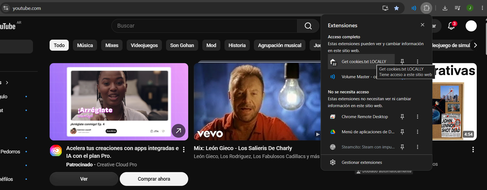
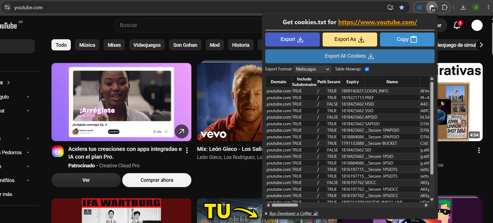

# SoftwareFreeMp3

Aplicación de escritorio y web para descargar y previsualizar contenido multimedia utilizando Node.js, Electron, yt-dlp y FFmpeg.

El proyecto permite descargar audio y video mediante una interfaz gráfica utilizando herramientas de código abierto.

Cuenta con dos modos de funcionamiento:

- Aplicación de escritorio mediante Electron.
- Versión web ejecutando el servidor Node.js directamente.

---

# Aplicación de escritorio (Electron)

La versión de escritorio funciona como una aplicación independiente.

El usuario final no necesita instalar ni configurar:

- Node.js.
- FFmpeg.
- yt-dlp.
- Extensiones del navegador.
- Cookies manualmente.

Todas las herramientas necesarias son administradas internamente por la aplicación.

## Ejecutar en desarrollo

Instalar dependencias:

```bash
npm install
```

Ejecutar la aplicación:

```bash
npm run dev
```

Electron iniciará automáticamente la aplicación en una ventana independiente.

---

# Versión web / servidor

La versión web permite ejecutar el proyecto directamente como servidor Node.js.

Esta modalidad está pensada para desarrollo, pruebas o despliegue en servidores.

---

# Requisitos previos

Antes de iniciar el proyecto en modo servidor es necesario instalar las siguientes herramientas.

---

# 1. Node.js

Node.js es necesario para ejecutar el servidor y administrar las dependencias.

Descargar desde:

https://nodejs.org/es/download


Comprobar la instalación:

```bash
node -v
```

Ejemplo:

```
v24.x.x
```

Comprobar npm:

```bash
npm -v
```

Ejemplo:

```
11.x.x
```

---

# 2. Instalación del proyecto

Abrir el proyecto utilizando Visual Studio Code.

Abrir una terminal dentro de la carpeta del proyecto y ejecutar:

```bash
npm install
```

Esto instalará todas las dependencias necesarias:

```
node_modules/
```

---

# 3. Configuración de yt-dlp

El proyecto utiliza yt-dlp para obtener información, descargar y procesar contenido multimedia.

El ejecutable debe encontrarse dentro de:

```
src/bin/
```

Ejemplo:

```
src
│
├── bin
│   └── yt-dlp.exe
│
└── server.js
```

---

# 4. Configuración de cookies de YouTube

## ¿Cuándo son necesarias?

Las cookies son necesarias cuando se ejecuta la versión servidor y para contenido que requiere autenticación.

Ejemplos:

- Videos con restricciones.
- Bloqueos de YouTube.
- Protección contra bots.

La versión de escritorio Electron puede utilizar la configuración integrada del proyecto.

---

## Obtener cookies

Instalar la extensión de Chrome:

https://chromewebstore.google.com/detail/get-cookiestxt-locally/cclelndahbckbenkjhflpdbgdldlbecc


Abrir YouTube con una cuenta iniciada.





Abrir la extensión y seleccionar:

```
Export cookies
```





Se generará el archivo:

```
cookies.txt
```

Moverlo dentro de:

```
src/
```

La estructura final debe quedar:

```
SoftwareFreeMp3
│
├── src
│   │
│   ├── server.js
│   ├── cookies.txt
│   │
│   └── bin
│       └── yt-dlp.exe
│
├── node_modules
│
├── package.json
└── README.md
```

---

# 5. Ejecutar servidor manualmente

Para iniciar únicamente el servidor:

```bash
node src/server.js
```

Si todo funciona correctamente aparecerá:

```
Ruta de yt-dlp.exe:
C:\SoftwareFreeMp3\src\bin\yt-dlp.exe

Ruta de ffmpeg.exe:
C:\SoftwareFreeMp3\node_modules\ffmpeg-static\ffmpeg.exe

Ruta de cookies.txt:
C:\SoftwareFreeMp3\src\cookies.txt

Servidor corriendo en:
http://localhost:8080
```

---

# 6. Acceso a la aplicación

Abrir el navegador e ingresar:

```
http://localhost:8080
```

La aplicación estará disponible.

---

# Sistema de previsualización

La aplicación utiliza un sistema de streaming interno para generar previews de audio y video.

Funcionamiento:

```
Usuario
   |
   |
Aplicación Electron / Navegador
   |
   |
API Preview
   |
   |
yt-dlp obtiene el contenido
   |
   |
FFmpeg procesa el fragmento
   |
   |
Stream de audio/video
```

Las previews se generan mediante el backend y no dependen de URLs temporales externas.

---

# Solución de problemas

## Node.js no reconocido

Si aparece:

```
node is not recognized as an internal or external command
```

Reinstalar Node.js y verificar que esté activada la opción:

```
Add to PATH
```

---

## Error con yt-dlp

Si aparece un error relacionado con YouTube:

Comprobar:

- Que `yt-dlp.exe` exista dentro de `src/bin`.
- Que yt-dlp esté actualizado.
- Que las cookies sean válidas.
- Que la cuenta de YouTube siga iniciada.

---

## Error con FFmpeg

Reinstalar las dependencias:

```bash
npm install
```

Comprobar que exista:

```
node_modules/ffmpeg-static/
```

---

## Error de caché en Electron

Si aparece:

```
Unable to create cache
Gpu Cache Creation failed
```

Estos mensajes pertenecen al sistema interno de Chromium utilizado por Electron.

Normalmente no afectan al funcionamiento de la aplicación.

Si ocurre durante desarrollo:

1. Cerrar Electron.
2. Eliminar la caché generada.
3. Ejecutar nuevamente:

```bash
npm run dev
```

---

# Tecnologías utilizadas

| Tecnología | Uso |
|------------|-----|
| Electron | Aplicación de escritorio |
| Node.js | Backend |
| Express | API y servidor |
| yt-dlp | Extracción multimedia |
| FFmpeg | Procesamiento de audio y video |
| npm | Gestión de dependencias |

---

# Estructura del proyecto

```
SoftwareFreeMp3
│
├── electron
│   │
│   ├── main.js
│   └── preload.js
│
├── src
│   │
│   ├── bin
│   │   └── yt-dlp.exe
│   │
│   ├── cookies.txt
│   ├── server.js
│   │
│   ├── controllers
│   ├── routes
│   ├── services
│   └── utils
│
├── public
│   │
│   ├── index.html
│   ├── css
│   └── js
│
├── node_modules
│
├── package.json
└── README.md
```

---

# Autor

Jean-Pierre001